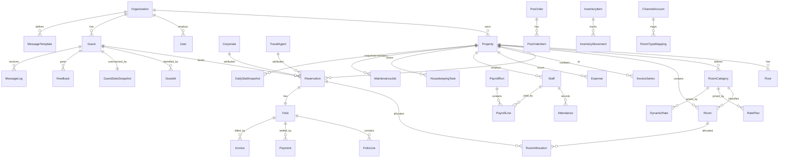

# Entity-Relationship Model

Visual companion to the canonical [`prisma/schema.prisma`](../../prisma/schema.prisma) (the source of truth). Shows the core relationships; the schema has the full field set and the [schema-deltas](../architecture/schema-deltas.md) list additive extensions per module.

## Core ERD

## Entity ownership (which module writes which table)
| Owning module | Tables |
|---|---|
| 00-platform | Organization, User, RoleAssignment, PermissionOverride, AuditLog, DomainEvent, IntegrationInbox |
| 01-property | Property, Floor |
| 02-room-inventory | RoomCategory, Room |
| 03-reservations | Reservation, RoomAllocation |
| 04-guest-crm | Guest, GuestId |
| 05-guest-history | GuestStatsSnapshot |
| 06-billing | Folio, FolioLine, Payment, InvoiceSeries, Invoice |
| 07-expenses | Expense |
| 09-staff | Staff, Attendance |
| 21-payroll | PayrollRun, PayrollLine |
| 10 / 11 | HousekeepingTask / MaintenanceJob |
| 12-comms | MessageTemplate, MessageLog, Feedback |
| 13-channels | ChannelAccount, RoomTypeMapping |
| 14-analytics | DailyStatSnapshot, NightAuditRun |
| 19 / 20 | PosOrder, PosOrderItem / InventoryItem, InventoryMovement |
| 24 / 25 | DynamicRate, RatePlan / Corporate, TravelAgent |

## Invariants encoded in the schema
- **No overbooking**: `RoomAllocation` gets a PostgreSQL `EXCLUDE` constraint on `(roomId, daterange)` (03).
- **Gap-free invoices**: `InvoiceSeries.nextNumber` consumed under row lock; `Invoice(propertyId, number)` unique (06).
- **Append-only money**: `FolioLine`/`Payment`/`Invoice` insert-only; corrections are reversing rows (06).
- **Money = paise** (`Int`/`BigInt`); **time** = UTC instants + property-local `@db.Date`.
- **Tenancy**: every operational table carries `propertyId`; queries scoped via `db.scoped(user)`.
