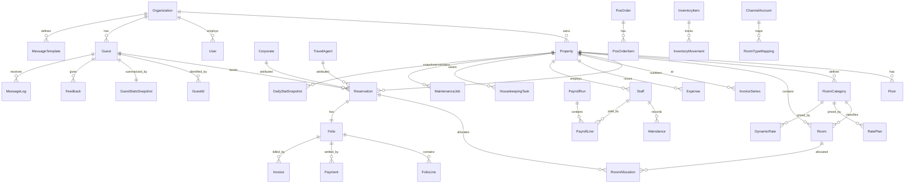

# Entity-Relationship Model

Visual companion to the canonical [`prisma/schema.prisma`](../../prisma/schema.prisma) (the source of truth, **finalized — 66 models, all deltas applied**). The mermaid diagram below shows the **core** relationships (not every table); the ownership table further down lists **all 66 models** by owning module.

## Core ERD (key relationships)

## Entity ownership (all 66 models, by owning module)
| Owning module | Tables |
|---|---|
| 00-platform | Organization, User, RoleAssignment, PermissionOverride, PasswordResetToken, Session, SecuritySettings, AuditLog, DomainEvent, IntegrationInbox, BackupRun |
| 01-property | Property, Floor |
| 02-room-inventory | RoomCategory, Room, RoomBlock |
| 03-reservations | Reservation, RoomAllocation |
| 04-guest-crm | Guest, GuestId |
| 05-guest-history | GuestStatsSnapshot |
| 06-billing | Folio, FolioLine, Payment, InvoiceSeries, Invoice, Coupon, CouponRedemption |
| 07-expenses | Expense |
| 09-staff | Staff, Attendance, StaffAdvance, StaffDocument |
| 21-payroll | PayrollRun, PayrollLine |
| 10 / 11 | HousekeepingTask / MaintenanceJob |
| 12-comms | MessageTemplate, MessageAutomation, Campaign, CommunicationConsent, MessagingAccount, MessageLog, Feedback |
| 13-channels | ChannelAccount, RoomTypeMapping, ChannelSyncLog |
| 14-analytics | DailyStatSnapshot, NightAuditRun |
| 15-search-export | ExportJob |
| 18-ai | AiInteractionLog, GuestSegment |
| 19-pos | PosOutlet, MenuItem, PosOrder, PosOrderItem |
| 20-inventory | InventoryItem, InventoryMovement, RecipeComponent |
| 22-accounting-sync | AccountingConfig, AccountingSyncLog |
| 23-booking-engine | BookingEngineConfig, BookingEngineOrder |
| 24-dynamic-pricing | RatePlan, DynamicRate |
| 25-corporate-crm | Corporate, TravelAgent, NegotiatedRate |
| 26-data-onboarding | ImportBatch, ImportRow |

(16-access-control and 17-mobile own no tables — they operate on 00's models / are client-side. Total = 70.)

## Invariants encoded in the schema
- **No overbooking**: `RoomAllocation` gets a PostgreSQL `EXCLUDE` constraint on `(roomId, daterange)` (03).
- **Gap-free invoices**: `InvoiceSeries.nextNumber` consumed under row lock; `Invoice(propertyId, number)` unique (06).
- **Append-only money**: `FolioLine`/`Payment`/`Invoice` insert-only; corrections are reversing rows (06).
- **Money = paise** (`Int`/`BigInt`); **time** = UTC instants + property-local `@db.Date`.
- **Tenancy**: every operational table carries `propertyId`; queries scoped via `db.scoped(user)`.
